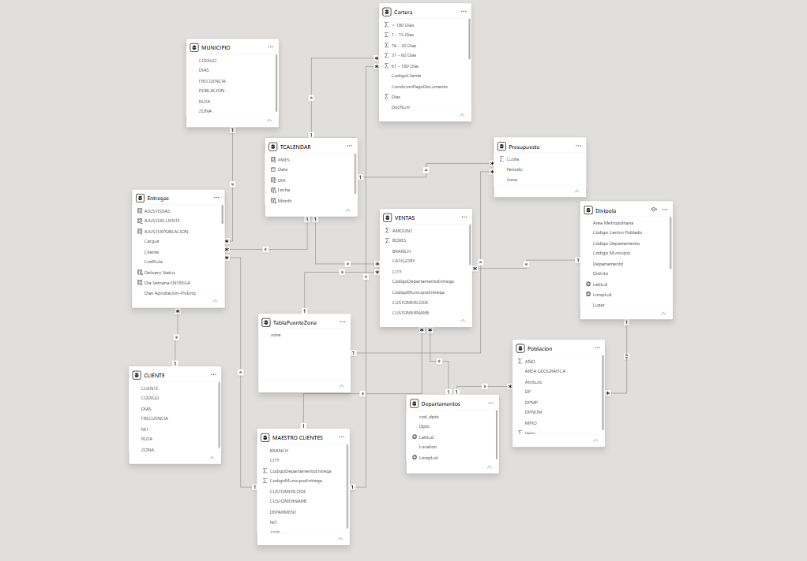
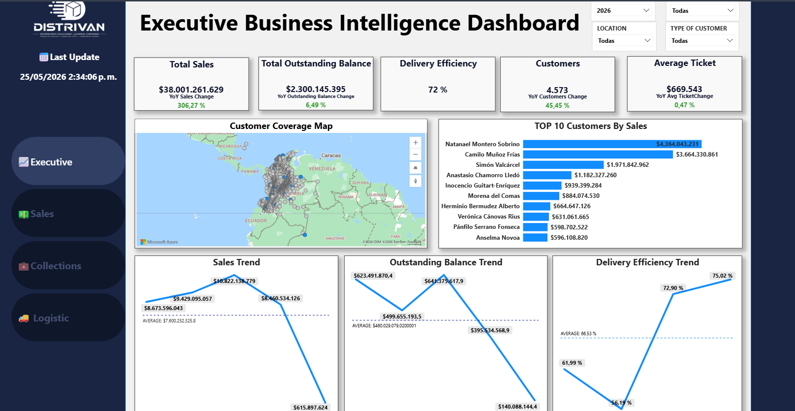
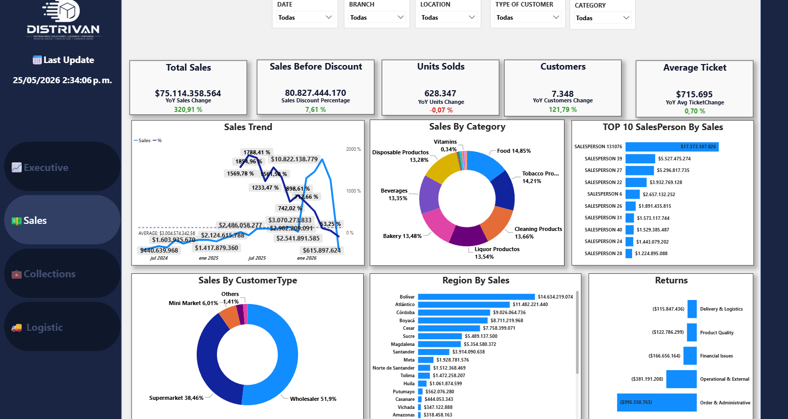
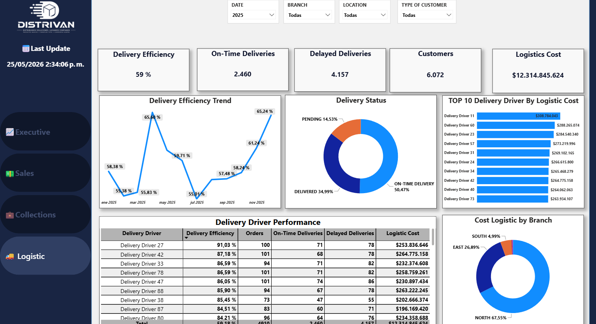
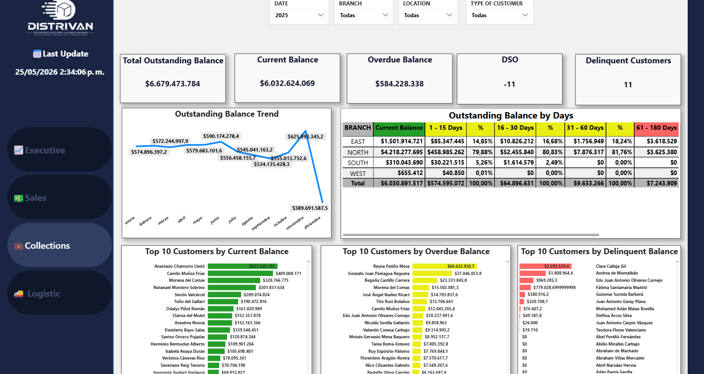

# Executive Business Intelligence Dashboard

## Overview

This project presents an executive Business Intelligence solution developed in Power BI, integrating Commercial, Logistics, and Accounts Receivable information into a centralized analytical platform.

The objective was to provide management with a unified view of business performance, operational efficiency, customer behavior, and financial health through interactive dashboards and KPI monitoring.

---

## Data Sources & Preparation

The original solution was built using real corporate data extracted through SQL queries from multiple operational systems.

To protect confidential business information, all sensitive data was anonymized before publication, including:

* Customer names
* Sales values
* Branch locations
* Cities and regions
* Commercially sensitive information

While the values were modified, the business logic, data structure, relationships, KPIs, and analytical methodology were preserved to maintain the integrity of the case study.

---

## Data Standardization & Simulation

The available datasets contained different historical periods:

| Dataset             | Available Period |
| ------------------- | ---------------- |
| Sales               | 2024 - 2026      |
| Accounts Receivable | 2025 - 2026      |
| Logistics           | 2026             |

To create a complete analytical environment, missing periods were standardized using historical patterns, business rules, and AI-assisted simulation techniques.

This process allowed the creation of a coherent dataset covering the period from 2024 to 2026 while preserving realistic trends and operational behavior.

---

## Technical Development

The project included:

* SQL data extraction
* Data transformation using Power Query
* Data modeling in Power BI
* KPI development using DAX
* Interactive dashboard design
* Executive reporting
* Historical trend analysis
* Cross-functional business performance monitoring

---

# Data Model

The analytical model was designed following best practices for scalability and performance.

### Relationship Model

---

# Dashboard Screenshots

## Executive Overview

---

## Commercial Performance

---

## Logistics Performance

---

## Accounts Receivable Analysis

---

# Key Business Findings

## Commercial Growth

The analysis revealed strong growth in both sales volume and customer acquisition across the analyzed periods.

The organization demonstrated significant commercial expansion and increasing market penetration.

### Example Visualization

---

## Logistics Performance

Although sales increased considerably, logistics performance indicators showed a gradual decline in on-time deliveries.

Results suggest that operational capacity has not expanded at the same pace as commercial growth, impacting service levels and customer experience.

### Example Visualization

---

## Accounts Receivable Stability

Accounts receivable indicators remained stable throughout the analyzed period and stayed within the company's defined credit and collection policies.

This suggests healthy financial management practices and a sustainable cash flow position.

### Example Visualization

---

# Strategic Recommendations

Based on the findings, the following recommendations were identified:

* Strengthen logistics capacity to support business growth.
* Improve delivery planning and operational efficiency.
* Maintain current credit and collection controls.
* Continue monitoring the relationship between sales growth and service levels.
* Align operational resources with future commercial expansion.

---

# Technologies Used

* Power BI
* DAX
* Power Query
* SQL
* Data Modeling
* Artificial Intelligence (Data Standardization & Simulation)

---

# Interactive Dashboard

You can explore the complete interactive dashboard here:

🔗 **Power BI Service Link**

PASTE_YOUR_POWER_BI_LINK_HERE

---

# Disclaimer

This project contains anonymized and simulated data based on a real-world business scenario.

All sensitive business information has been modified to protect confidentiality while preserving the analytical structure, business logic, and decision-making context of the original solution.
